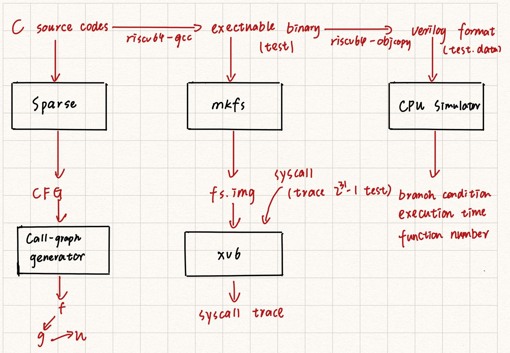

# My-Toybox
In real-world programming, sometimes we want to know why our algorithms or programs run slowly. In this case, we may rely on some tools to monitor the runtime behaviors of our programs (e.g., `strace`, `gdb`, `perf`, etc). They may offer us some useful information. For example, if we call lots of system calls, the program may waste a lot of time of the switch of kernel and user mode. Unfortunately, no such tools can provide everything we want. 

In this project, I provide a program analysis platform, which can automatically monitor the runtime behaviors of programs (e.g., function calls, branch condition, etc). 

-----

## Setup Enviroment
To begin with this project, you can configure the enviroment via the following several ways:

* **Ubuntu:**

    Run the following commands:

        $ sudo apt-get install git build-essential \ 
            gdb-multiarch qemu-system-misc \
            gcc-riscv64-linux-gnu binutils-riscv64-linux-gnu cmake
        $ git submodule update --init --recursive

* **Mac OS:**

     Run the following commands:

        $ brew tap riscv/riscv
        $ brew install riscv-tools
        $ PATH=$PATH:/usr/local/opt/riscv-gnu-toolchain/bin
        $ brew install qemu
        $ git submodule update --init --recursive

* **From docker:**

        $ docker pull sjx723/my_toybox:latest
        $ cd ~/My-Toybox

## Main Design

Firstly, it needs to be mention that I reuse two open-source repo: `Sparse` and `xv6`, and a risc-v cpu simulator for my [PPCA (2020 summer)](https://acm.sjtu.edu.cn/wiki/PPCA_2020) assignment. Main design is shown in the following figure,

* `Sparse` is a linux kernel static analysis tool, which looks like a compiler. It accepts C source codes as input and output their possible bugs. The source codes are first converted into AST, and then be linearized to CFG.

* `xv6` is a lightweighted operating system for [MIT 6.s081 (2021 fall)](https://pdos.csail.mit.edu/6.828/2021/overview.html). 

* `riscv-simulator` is one of my course assignment. Within this project, I implemented a five-statge pipelined cpu simulator. It supports RV32I instruction set.

Detailed implementation of each metric are shown below: 

* For **building call graph**, I have implemented a extenstion to `Sparse` in the two files: `Sparse/call-graph.h` and `Sparse/call-graph.c`. When given the C source code, `Sparse` will first construct a control-flow graph for each function (this step is also called `linearization`). In sparse, each function will be allocated a unique id. As shown in the following struct, I use adjacency list to represent the call-graph.  
    
        struct call_node {
            struct ident* id;                   // the id of this function
            struct call_node_list* neighbors;   // its neighbor nodes in the call-graph.
            int visited;                        // whether it is visited by bfs
        };
    
    After the linearization, I traverse the call-graph from the node of the `main` function, and do BFS to calcuate the number of reachable nodes in the call-graph. 

* For the number of **system calls**, I recall the recent lab (syscall lab) I have done in MIT 6.s081. Within this lab, I have implemented a system call `trace`. It accepts a mask number as argument and moniter all the system calls whose number are set in the mask. 
    
    For `trace()`'s implementation, I introduce a new member `mask` to the struct of process state. When user program invokes `fork()`, we need to also copy this member to the child process's proecess state. Each time the user invokes system call, os will use `ecall` instruction and switch to kernel mode to run the `syscall()` function in `kernel/syscall.c`. Hence, I add a check within `syscall()` function to check whether its syscall number is set in the mask.

    Futher, I reuse `trace()` to counting the number of system calls. This is not hard to implement since I can just simply set the mask as $2^{31}-1$. 
    
    However, the things which I find are really non-trival to handle are communication between the host os and xv6. I just use a simple but slow idea, I also write the under checking binary files into the file system image `fs.img` before starting QEMU simulator. Next, I run the QEMU emulator and redirect the output. I save the check results at `out/xv6.log` and `out/xv6_metadata.txt`, and set the QEMU timeout period to `10s`.

* For the number of **branch condition**, I have implemented a 2-bit branch condition predictor in the risc-v simulator. I record the number of total branch conditions and successfuly predictions in file `riscv-simulator/prediction.hpp`.

* For **execution times**, I measure how many cycles the binary files cost. This is because I just run the binary files on cpu simulator, so I can not calculate its accurate clock frequency. 

* For the number of **function calls**, 

## Example Output

Take the `array_test1` for example, run command `sh run_all_tests.sh array_test1`, we can see the following output in `out/final_report.txt`:

    Execution result:                             123
    Total executing time:                         216(cycles)
    Success branch prediction:                    10
    Total branch cnnditions:                      22
    Successful conditional prediction  rate:      0.45
    Call Edge: caller: main --> callee: printInt
    Call Edge: caller: main --> callee: printInt
    Number of nodes in Call graph:                3
    Number of reachable nodes in Call graph:      2
    Number of syscall:                            2

Take the `qsort` for example, run command `sh run_all_tests.sh qsort`, we can see the following output in `out/final_report.txt`:

    Execution result:                             105
    Total executing time:                         1348112(cycles)
    Success branch prediction:                    146999
    Total branch cnnditions:                      200045
    Successful conditional prediction  rate:      0.73
    Call Edge: caller: qsrt --> callee: qsrt
    Call Edge: caller: qsrt --> callee: qsrt
    Call Edge: caller: main --> callee: qsrt
    Call Edge: caller: main --> callee: printInt
    Call Edge: caller: main --> callee: printStr
    Call Edge: caller: main --> callee: printStr
    Number of nodes in Call graph:                4
    Number of reachable nodes in Call graph:      4
    Number of syscall:                            2

Take the `superloop` for example, run command `sh run_all_tests.sh superloop`, we can see the following output in `out/final_report.txt`:

    Execution result:                             134
    Total executing time:                         542079(cycles)
    Success branch prediction:                    374976
    Total branch cnnditions:                      435027
    Successful conditional prediction  rate:      0.86
    Call Edge: caller: main --> callee: printInt
    Number of nodes in Call graph:                3
    Number of reachable nodes in Call graph:      2
    Number of syscall:                            2
## Limitations and Possible Improvements

**Limitation:**

1. **I have not built a complete toolchain.** As above description, we can see that `xv6` runs on QEMU simulator and the risc-v cpu simulator just uses `riscv64-unknown-elf-gcc`'s output binary codes.
2. **The communication between xv6 and guest os is slow.** Each time I want to run a new test, I need to delete the old file system image and remake one. It costs a lot time on making image and starting qemu simulator.  
3. **I do not implement a cache inside the cpu.** Due to the time limitaion, I do not implement a cache, hence I can not any message about the cache miss rate.

**Possible Improvements:**

1. I think it would be a better design if `sparse` can translate C source codes to RV32I assembly codes and feed them to the risc-v simulator, and `xv6` can schedule the risc-v simulator rather than qemu.
2. I have used another intelligent method to commuinate between guest os and host os during my internship in IPADS. At that time, the guest and host os are both linux kernel. I used a folder to monitor a device when starting qemu in the host os. After starting the guest os, I mount the device on a folder in the guest os's file system. Therefore, the guest and host can communicate via this sharded folder.
3. More features can be added to the os and cpu. The possible features are listed as follow:
    
    - Add cache to the cpu simulator.
    - Implement the interrupt functions of xv6 and record the interrupts of a program (e.g., page fault, divide zero).
    - Choose a smarter method to do branch prediction. 